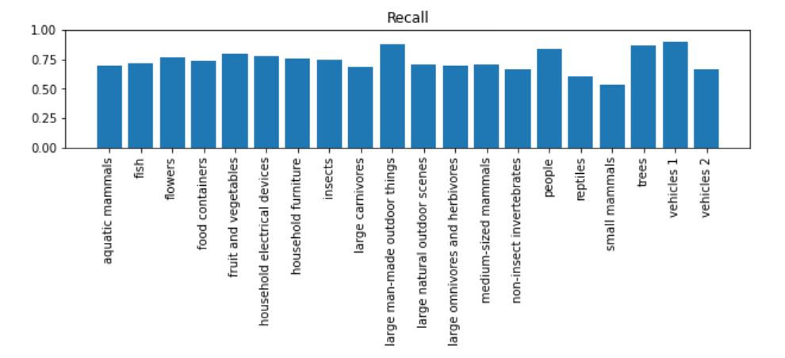
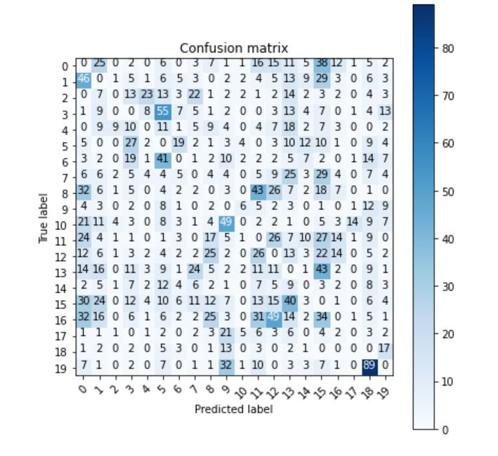

# Deep-Learning image classification.

Image recognisition and classification has become a leading application in deeplearning which has found applications in Medical image diagnosis, self driving cars , car number plate reading in self operated parkings. Applications of Deep learning are still growing exponentially. 
In this project, I performed an Image classification task on a CIFAR100 [dataset](https://www.cs.toronto.edu/~kriz/cifar.html) 

### Requirements:
* First downloading the dataset.
* Having the GPU enabled when running via colab.
* The algorithm can also be run localy as a Jupyter notebook.

The task involved developing and training a convolutional neural network to perform image recognision and classification. The network was fine tuned with these hyper parameters below;

* Regularisation
* Batch normalization
* Convolution and pooling layers.
* Augmentation.

In this repository, I attach a full python script that accurately performed the recognition & classification task with an accuracy of over 97%. Evalution was performed using the approaches below:

* confussin matrix.
* Precision, recall and F1 Score.
 
 

