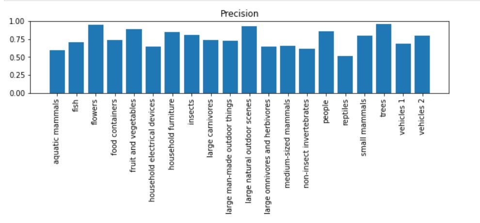

# Deep-Learning image classification.
In this project, I performed an Image classification task on a [CIFAR-100 dataset](https://www.cs.toronto.edu/~kriz/cifar.html).

### Requirements:
* First downloading the dataset.
* Having the GPU enabled when running the notebook via colab.
* The notebook can also be run localy as a Jupyter notebook.

The task involved developing and training a convolutional neural network to perform image recognision and classification. The network was fine tuned with these hyper parameters below;

* Learning rate.
* Bach size.
* Number of epochs.
* Regularisation.
* Batch normalization.
* Convolution and pooling layers.
* Augmentation.

In this repository, I attach a full Python Notebook that accurately performed the classification task with an accuracy of over 97%. Evalution was performed using the classification approaches below:

* Confussin matrix.
* Precision, Recall and F1 Score.
 
 
 

